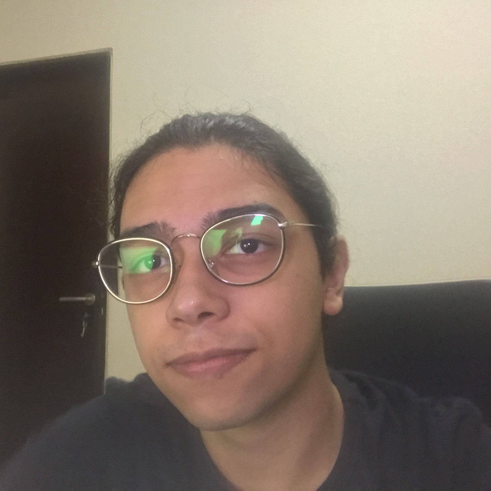

  
 
  

# Introdução

Nesta repositório demonstraremos a primeira versão do OpenDIP, uma biblioteca desenvolvida como trabalho prático para o curso Introdução ao Processamento Digital de Imagens durante o período 2020.1, ministrada pelo [Prof. Leonardo Vidal](http://lattes.cnpq.br/1047122596139990).

Nessa primeira versão, apresentaremos três funcionalidades: Conversão de espaço, em que implementamos os conversores RGB-YIQ e YIQ-RGB; Correlação de Imagens, em que aplicamos filtros pontuais como Sobel, Negativo em RGB, Negativo em Y, Média e Mediana; Correlação Normalizada, que encontra o que é mais semelhante de uma imagem em outra.

A aplicação pode ser acessada em: [OpenDIP Demo](https://opendip.herokuapp.com)

## Metodologia

Para o desenvolvimento da biblioteca escolhemos a linguagem Python, devido à sua praticidade e bibliotecas como Numpy e Pillow, que respectivamente permitem trabalhar melhor com vetores e manipular a entrada e saída de imagens. Além disso, utilizamos a biblioteca Streamlit para realizar essa demonstração, a fim de documentar nosso trabalho de maneira clara e com uma linguagem bastante visual.

## Como contribuir

Caso tenha gostado da iniciativa e queira contribuir para com o desenvolvimento da biblioteca, após a finalização da disciplina iremos começar a aceitar pull requests no nosso [repositório no github](https://github.com/jpvt/Digital_Image_Processing).

## Clone

- Clone esse repositório na sua máquina local utilizando:
    > https://github.com/jpvt/Digital_Image_Processing.git

## Autores

|<a href="https://www.linkedin.com/in/jpvt/" target="_blank">**João Pedro Vasconcelos**</a> | <a href="https://linkedin.com/in/itamarrocha" target="_blank">**Itamar Filho**</a>      |<a href="https://www.linkedin.com/in/jo%C3%A3o-wallace-b821bb1b0/" target="_blank">**João Wallace Lucena**</a> | <a href="https://www.linkedin.com/in/sheywesk-medeiros/" target="_blank">**Sheywesk**</a>      |
|:-----------------------------------------------------------------------------------------:|:---------------------------------------------------------------------------------------:|:-----------------------------------------------------------------------------------------:|:---------------------------------------------------------------------------------------:| 
|                    </img>                            |                </img>                          |                    </img>                            |                </img>                          |
|               <a href="http://github.com/jpvt" target="_blank">`github.com/jpvt`</a>      |  <a href="https://github.com/ItamarRocha" target="_blank">`github.com/ItamarRocha`</a>  |               <a href="http://github.com/joallace" target="_blank">`github.com/joallace`</a>      |  <a href="https://github.com/sheywesk" target="_blank">`github.com/sheywesk`</a>  |
